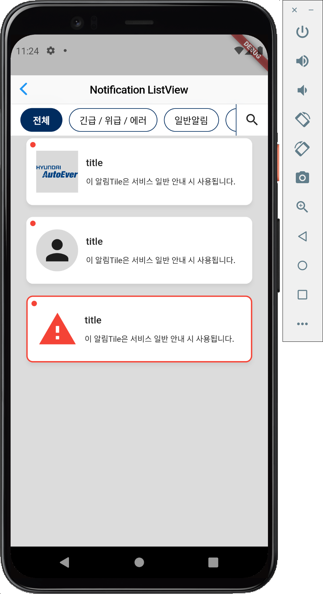

<h1 align="center">Notification ListView</h1>

<p align="center">
<a href="https://www.hyundai-autoever.com/kor/main/index.do" target="_blank" rel="noreferrer noopener">
    
</a>
</p>

<p align="center">
  <a >
    
  </a>
  <a>
    
  </a>
</p>

---


## Features

This package is for **Hyundai AutoEver** internship assignments.

This list view is optimized for the notification type used in the Hyundai AutoEver project.


## Usage

```dart
Scaffold(
    body:  NotificationListView(
            hasHeader: true,
            onTapSearch: () {}, //nullable
            onTapAll: () {},
            onTapAlert: () {},
            onTapNormal: () {},
            onTapChatting: () {},
            selectedType: null, // for header button color
            isSearching: false, // for button color
            itemCount: 7,
            itemBuilder: (context, int i) => NotiListViewTile(
                isFirst: (i == 0) ? true : false, // for top margin
                isNew: true, // for badge
                title: "title",
                content: "content",
                notiTileType: notiTileType.normal,
                ),
            ),
    );
```

## Showcase


## Additional information

NotificationListView is the same as listview.builder except for the header related properties.
